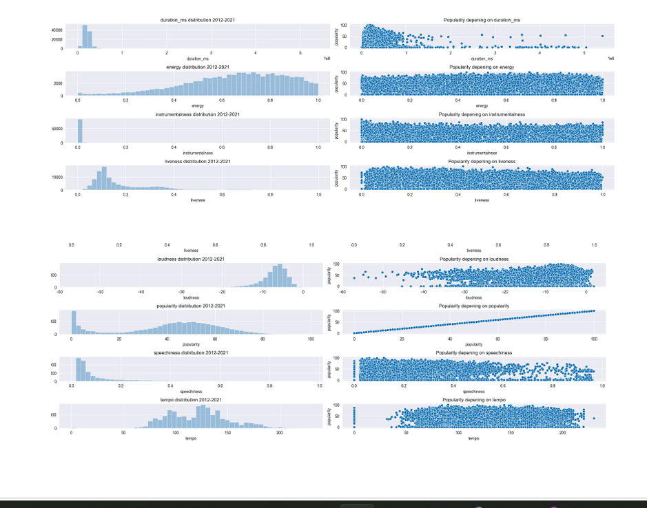
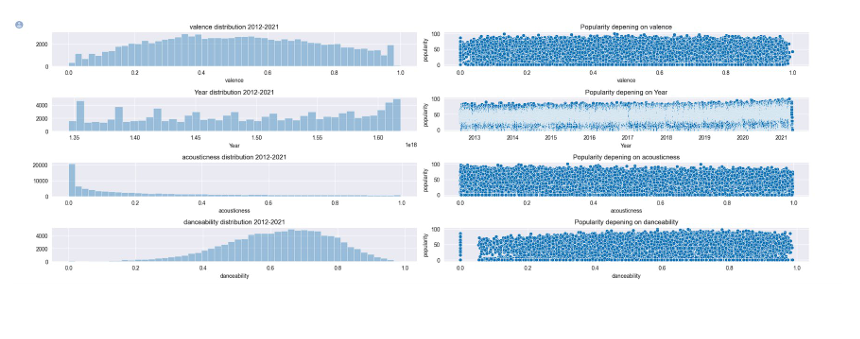
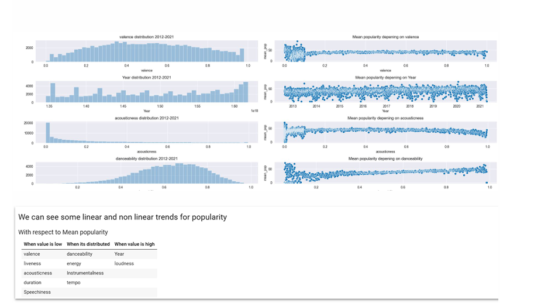
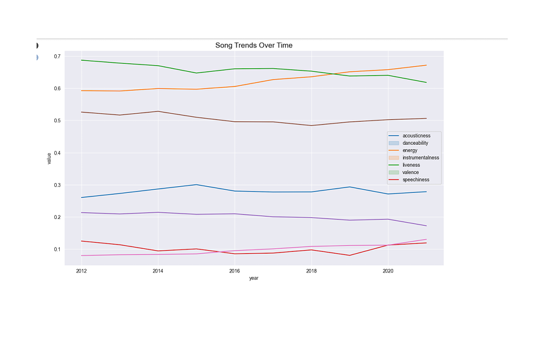
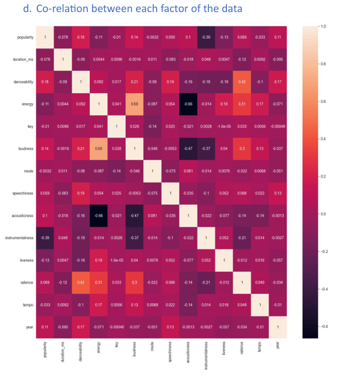
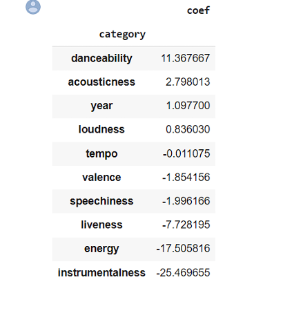
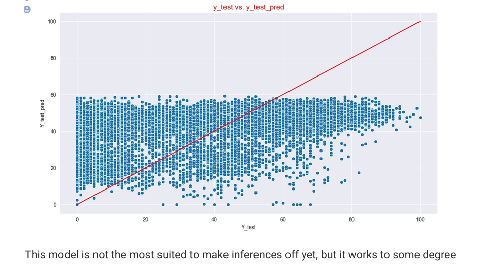
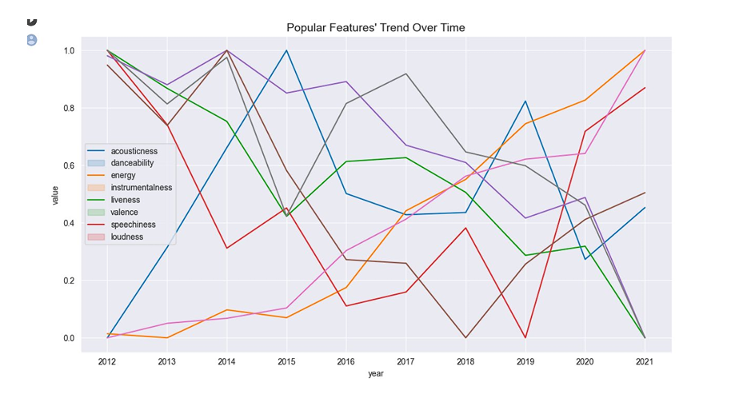
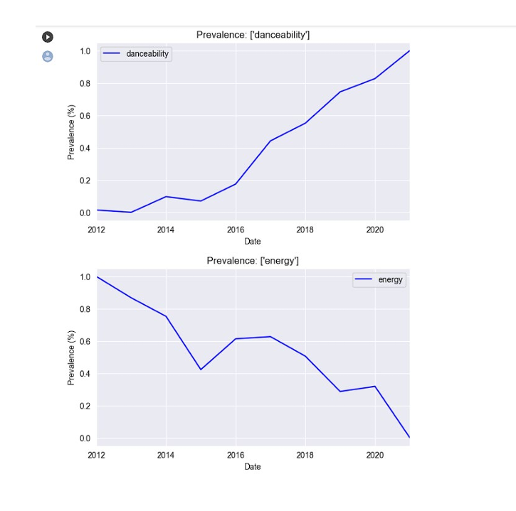

# Spotify Dataset Analysis Using Python

## Project Overview
This project focuses on analyzing Spotify music streaming data using Python and Time Series Analysis techniques to identify the factors that influence song popularity and how song features evolve over time.

The project explores relationships between audio features such as:
- Danceability
- Energy
- Loudness
- Tempo
- Valence
- Acousticness
- Instrumentalness

Using Linear Regression and Time Series methodologies, the project analyzes how these features contribute to song popularity and streaming performance on Spotify.

---

## Business Problem
Spotify relies heavily on recommendation systems and user engagement strategies to improve user experience and music discovery.

Understanding:
- what makes a song popular,
- how music trends evolve,
- and which audio features influence streaming counts

can help improve:
- recommendation systems
- playlist optimization
- music promotion strategies
- user engagement

---

## Objectives

- Analyze Spotify streaming data
- Identify features affecting popularity
- Perform Time Series Analysis
- Explore feature changes over time
- Implement Linear Regression concepts
- Generate insights for recommendation systems

---

## Dataset Information

### Dataset Includes
- Song popularity
- Danceability
- Energy
- Loudness
- Tempo
- Acousticness
- Instrumentalness
- Speechiness
- Valence
- Release Year

---

## Technologies & Tools Used

### Programming Language
- Python

### Libraries Used
- Pandas
- NumPy
- Matplotlib
- Seaborn
- Scikit-learn
- Statsmodels

---

## Methodologies Used

### Time Series Analysis
Used to identify:
- trends
- seasonal patterns
- feature evolution over time

### Linear Regression
Used to model the relationship between song features and popularity.

### ARIMA & SARIMA Concepts
Applied for understanding feature trends and forecasting possibilities.

---

## Key Insights

### Positive Influence on Popularity
- Danceability
- Energy
- Loudness
- Recent release years

### Negative Correlations
- Acousticness negatively correlated with loudness and energy
- Instrumentalness negatively correlated with danceability

### Trend Observations
- Danceability increased over time
- Energy trends fluctuated across years
- Social media influence contributed to popularity growth

---

## Team Contribution

This project was completed as part of a group academic project.

### My Contributions
- Data Cleaning & Preprocessing
- Exploratory Data Analysis
- Correlation Analysis
- Visualization Development
- Time Series Trend Analysis
- Documentation & Insights

---

## Visualizations

### Feature Distribution Analysis

---

### Correlation & Outlier Analysis

---

### Mean Popularity Analysis

---

### Song Trends Over Time

---

### Spotify Correlation Heatmap

---

### Linear Regression Model Results

---

### Model Validation Scatterplot

---

### Feature Change Over Time

---

### Danceability & Energy Trends

---

## Skills Demonstrated

- Data Cleaning
- Exploratory Data Analysis
- Time Series Analysis
- Linear Regression
- Correlation Analysis
- Data Visualization
- Statistical Analysis
- Predictive Modeling
- Business Analytics

---

## Future Improvements

- Build advanced recommendation systems
- Use Random Forest/XGBoost models
- Integrate Spotify API data
- Develop interactive dashboards
- Implement deep learning forecasting models

---

## Conclusion

This project successfully demonstrated how Time Series Analysis and Linear Regression can be applied to Spotify streaming data to identify the factors influencing song popularity.

The analysis provided valuable insights into evolving music trends, feature relationships, and recommendation system optimization.

The project highlights the importance of data analytics and machine learning in understanding user preferences and improving music streaming experiences.

---

## Author
### Raj Verma

Business & Data Analytics Enthusiast
